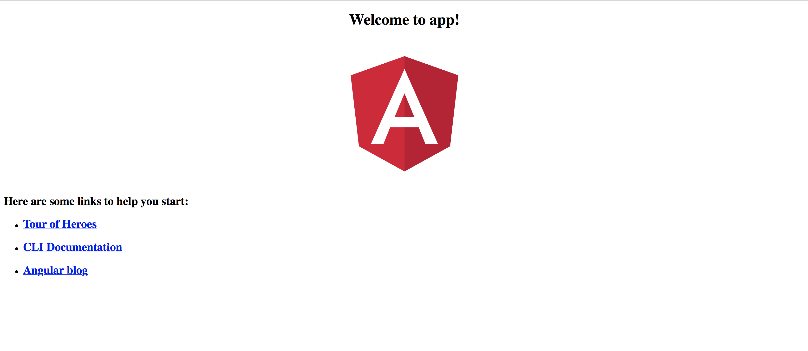

# ADAT_Visual
Proyecto de investigación ADAT en el que se realiza una aplicacion web MEAN (MongoDB,ExpressJS,AngularJS,NodeJS)

Parte de Backend realizada en el siguiente git: https://github.com/SergioRedondoMontes/API_NodeJS_Mongo.git

PROYECTO REALIZADO POR:

- Adrian Naranjo https://github.com/adrinaranjo94
- Sergio Redondo https://github.com/SergioRedondoMontes
- Oscar de la Fuente https://github.com/Gringo97

# Parte visual

## Para llevar a cabo la parte visual de la aplicacion web, debemos tener instalado Angular-CLI.

En este enlace estará la documentación oficial de Angular-CLI
https://angular.io

### Instalacion 
* Abrimos un terminal.
```
npm -g install angular/cli
```
-g instala angular de manera global, es decir, se podra acceder a sus comandos desde cualquier parte del sistema.

* Creación del proyecto
- Desde el terminal nos ubicamos en la ruta donde crearemos el proyecto.
- Escribiremos el siguiente comando.

```
ng new app
```

- Despues de crear todos los archivos necesarios, entramos dentro de la carpeta

```
cd app
```

- Para lanzar la app, escribiremos el siguiente comando

```
ng serve
```
Tras finalizar tendremos que ir a la ruta http:/localhost:4200 . Si ha funcionado abrirá la app que hemos creado.

- Para lanzar la app directamente y que acceda a la pagina web por defecto, lanzaremos el siguiente comando sobre la carpeta del proyecto

```
ng serve -o
```

Esta sera la página que veremos por defecto:



### Contenido del proyecto
Iniciamos el proyecto en un editor como Atom, Brackets, Visual Code.

En nuestro proyecto aparecerán varias carpetas:
- e2e : Pruebas unitarias
- angular-cli.json: archivo de configuración de angular cli
- gitignore: archivos que serán ignorados al hacer commit
- karma.conf.js: pruebas unitarias
- package.json: archivo importante para proyecto, contiene las dependencias necesarias para el proyecto
- protactor.conf.js: archivo configuración de pruebas
- tsconfig.json: archivo configuración ts
- tslint.json: embellecedor de los errores en el elemento

- src:
  -	App: la primera pantalla que se abre
    -	App.component.ts: Componente que se abre al lanzar la pagina
    -	App.component.css: sirve para estilizar al app.component.html
    -	App.component.html: Contenido html que mostrara el componente
    -	App.component.spec.ts: pruebas unitarias
    -	App.module.ts: definimos las librerías que usará el componente
      -	Imports para importar librerías
      - Providers: servicios, archivos compartidos a lo largo de toda la aplicación
  -	Assets: archivos, videos imágenes que se usaran
  -	Enviroments
      -	Enviroment.ts: desarrollo
      -	Enviroment.prod.ts: producción
  -	Index.html: la pagina de la aplicación
  -	Main.ts: archivo que usa el appModulo
  -	Polifills.ts: aumentar compatibilidad en las aplicaciones
  -	Styles.css: estilo global de la aplicación
  -	Tsconfig.app.json: configuración de la app
  -	Tsconfig.spec.json: configuración de pruebas
  -	Typings.d.ts: definir variables globales a lo largo de la aplicación
  -	Node_modules: contiene las librerías que iremos instalando para el proyecto


#### Añadir un componente
```
ng g c footer
```
Si añadimos al final -is no nos creara el footer.component.css
Y si añadimos al final --spec=false no nos creara el footer.component.spec.ts

### Instalar otras librerias
Formas de instalar Bootstrap:
- Usando CDN
- Usando download y metiéndolo dentro de assets
- Instalacion por npm de bootsrap, Popper y jQuery:

Bootstrap: 
```
npm install bootstrap@4.0.0-beta.2
```
jQuery: 
```
npm install jquery
```
Popper:
```
npm install popper.js
```
Angular schematics: 
```
npm install @angular-devkit/schematics@0.0.34 -save
```

Si añadimos un -save, al instalar el proyecto en otra ubicación, descargará automáticamente esas dependencias

Añadimos estas librerias en angular-cli.json en styles metemos el css de bootstrap y en scripts los js:

```
"styles": [
        "styles.css",
        "../node_modules/bootstrap/dist/css/bootstrap.min.css"
      ],
      "scripts": [
        "../node_modules/popper.js/dist/umd/popper.min.js",
        "../node_modules/jquery/dist/jquery.slim.min.js",
        "../node_modules/bootstrap/dist/js/bootstrap.min.js"
      ],
...
```
### Establecer Rutas

Para que se pueda navegar entre los componentes del proyecto, crearemos las rutas

- Dentro de src/app/ crearemos un archivo que se llame app.routes.ts
- Importaremos los componentes necesarios para su funcionamiento y después los componentes entre los que se navegará.

```
import { RouterModule, Routes} from '@angular/router';
import {HomeComponent} from './components/home/home.component';

const APP_ROUTES : Routes = [
    {path: 'home',component:HomeComponent},
    {path: '**',pathMatch:'full',redirectTo:'home'}
];

export const APP_ROUTING = RouterModule.forRoot(APP_ROUTES);
```

En el caso que falle alguna ruta, se redirigirá a home.

- Después debemos importar el componente de rutas en el modulo de app
- Finalmente añadiremos la clase en el array de imports de @NgModule de app.module.ts

```
import {APP_ROUTING} from './app.routes';

imports: [
    BrowserModule,
    APP_ROUTING
  ],
```
- El uso de esta clase en HTML será el siguiente, en vez de usar href.

```
<ul class="navbar-nav mr-auto">
  <li class="nav-item active">
    <a class="nav-link" [routerLink]="['home']" >Home <span class="sr-only">(current)</span></a>
  </li>
</ul>
```

### Uso de Servicios

- Brindar información a quien lo necesite
-	Funcionalidad CRUD
-	Mantenerla data de forma persistente
-	Servir como recurso reutilizable para la aplicación

Generar un servicio

```
ng generate service service_name
```

* Importamos el servicio en app.module.ts y despues añadimos la clase en providers

```
import {ServiceName} from './services/name.service';

providers: [
    ServiceName
  ],
```

### Uso de los componentes en HTML

Para acceder a los objetos del componente desde HTML, utilizamos la nomenclatura de angular: {{}}

```
<p>{{vuelo.id}}</p>
```
Esto nos devolverá el id de ese vuelo al compilar el componente y aparecerá en la página web

Para recorrer un array usaremos una directiva de estructura : ngFor

Con esta directiva realizaremos un foreach con el que podremos crear codigo HTML específico por cada objeto del array:
```
<div class="text-center puntero vuelo" *ngFor="let vuelo of _iberia.vuelos" [routerLink]="['/vuelo',vuelo.num_vuelo]">
  <p>{{vuelo.origen}}</p>
  <p>{{vuelo.destino}}</p>
  <hr>
  <p>{{vuelo.precio}}</p>
</div> 
```

### HTTP Client

Para hacer peticiones a través de http
-	Importamos en el service
```
import {HttpClient} from '@angular/common/http';
```
-	Añadimos al constructor el http
```
constructor(public http : HttpClient) {} 
```
- Creamos un objeto url de tipo String
- Creamos un metodo que devolvera una cabecera especifica para la petición POST
- importamos map para crear un map que recogera el JSON y lo asignara al array

```
import 'rxjs/add/operator/map';

vuelos: any[] = [];
  urlVuelos:string = 'http://localhost:3000/flights';
  
  private getHeaders():HttpHeaders {
    let headers = new HttpHeaders({
      'Content-Type' : "application/x-www-form-urlencoded" 
    });

    return headers;
  }
  
  getVuelosIberia(ciudad:string,destino:string,fecha = "12-12-12") {
        let body = "ciudad=" + ciudad + "&destino=" + destino + "&fecha_salida=" + fecha;
        let headers = this.getHeaders();
    return this.http.post(this.urlVuelos,body,{headers})
      .map((resp:any)=> {
          console.log(resp);
        this.vuelos = resp;
        return this.vuelos;
      });
 }
```

Para realizar la peticion, la hacemos desde el componente:
- Añadimos al constructor el service y lo importamos
```
  import {IberiaService} from '../../services/iberia.service'
  
  constructor( public _iberia : IberiaService ) { }
```
- Añadimos un metodo que al llamarlo hara la peticion al servidor:
```
this._iberia.getVuelosIberia(this.origen,this.destino).subscribe();
```
Nos suscribimos para observar los cambios de los datos que recibimos del servidor.

# DESHABILITAR SEGURIDAD DE RESTRICCIONES DE ORIGEN CRUZADO

- Para poder arreglar el problema de seguridad que impide acceder a otros dominios locales, tenemos que desactivar en opciones del navegador las restricciones de origen cruzado.

Sin ello no podriamos acceder al servidor.

Esta web app esta en desarrollo por lo que no se ha pasado a producción. Para poder utilizarla debemos lanzar el comando:
```
ng serve
````

En caso de haber algun fallo, seguir las indicaciones del terminal.

